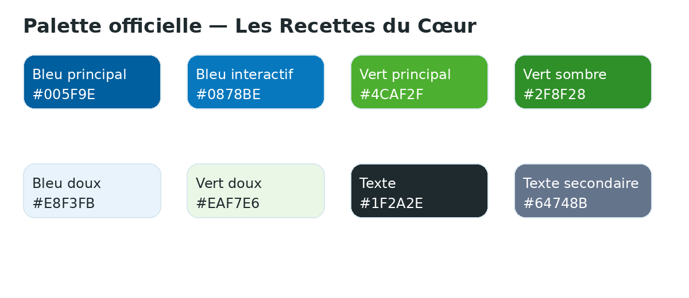
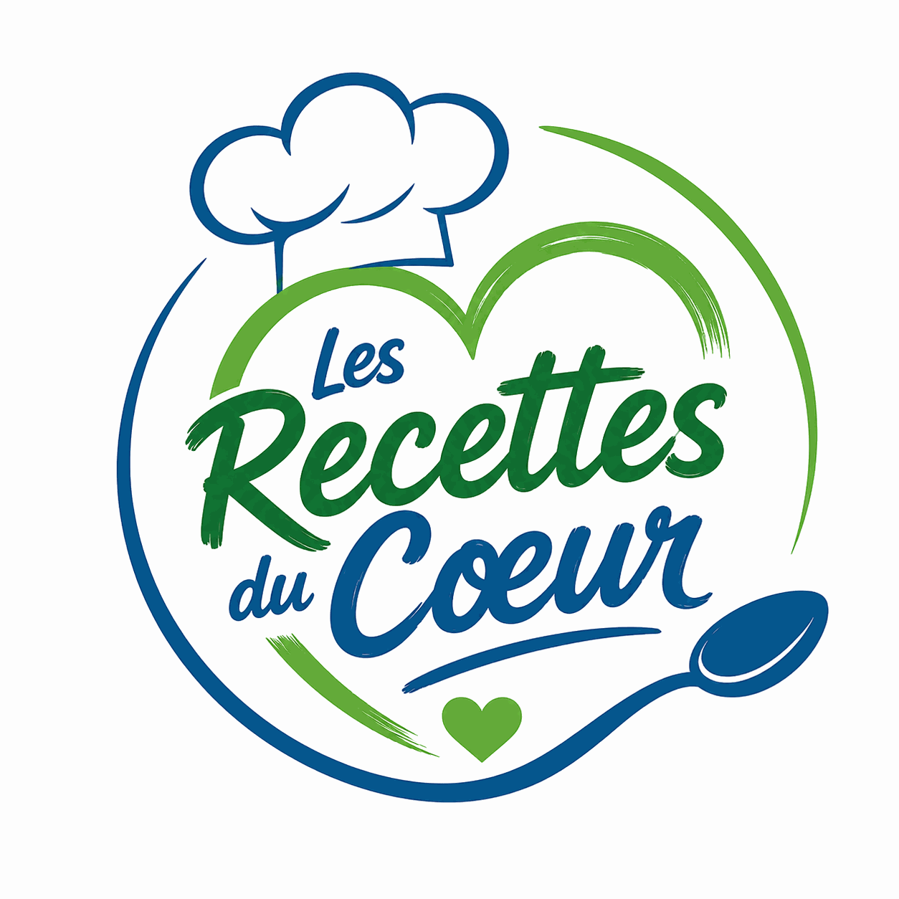

# 🎨 04 — Charte graphique

> **Document :** DOC-04  
> **Version :** V36  
> **Statut :** 🟢 Conforme  
> **Dernière mise à jour :** 12 juillet 2026  
> **Source de vérité :** Oui  
> **Documents liés :** DOC-05, DOC-06, DOC-07, DOC-08

## 🌈 Palette officielle

| Jeton | HEX | Usage |
|---|---:|---|
| `--blue` | `#005F9E` | Titres, boutons, identité |
| `--blue2` | `#0878BE` | Survols et accents |
| `--green` | `#4CAF2F` | Validation, anti-gaspi |
| `--green2` | `#2F8F28` | Texte vert sombre |
| `--bsoft` | `#E8F3FB` | Fonds informatifs |
| `--gsoft` | `#EAF7E6` | Badges et encadrés |
| `--text` | `#1F2A2E` | Texte principal |
| `--muted` | `#64748B` | Métadonnées |
| `--line` | `#D9E7EF` | Bordures |

## 🔤 Typographie

`system-ui, -apple-system, "Segoe UI", sans-serif` ; corps 16 px, interligne 1,55. Les titres utilisent des tailles fluides sans réduire la lisibilité.

## 🏷️ Logo et favicon

Conserver proportions et couleurs, ne pas étirer, protéger les marges et utiliser un export optimisé sur le site.

## 🗂️ Convention de nommage

Nouveaux fichiers : minuscules, sans accents, sans espaces, mots séparés par des tirets, une extension unique, aucun suffixe `(1)` ou nom brut d’outil.

Exemple : `loulou-cuisine-carnet.webp`.

Les anciens fichiers non conformes sont migrés progressivement après mise à jour de toutes leurs références.

## 📐 Familles de médias

Chaque famille possède un ratio, une largeur maximale et un poids cible adaptés : photographies 4:3, cartes homogènes, héros larges et responsives, mascottes transparentes, logos non recadrés, favicons carrés et QR codes contrastés.

## 📱 Responsive

Contrôler au minimum 320, 375–430, 768, 1024 et 1440 px. Les règles détaillées appartiennent au DOC-05.
